## 🧭 1. Objectif du document
- **Contexte** : pourquoi cette automatisation est nécessaire.  
- **Problématique à résoudre**.  
- **Public visé** (ex. : équipe marketing, formateur n8n, développeur).  

---

## 🎯 2. Résultats attendus
- Description du **comportement final** de l’automatisation.  
- **Indicateurs de réussite / KPI** (ex. : taux d’erreur < 2 %, gain de temps estimé).  
- Capture d’écran ou schéma illustrant le **flux utilisateur final**.  

---

## 🧩 3. Architecture globale
### 3.1 Vue d’ensemble
- **Description textuelle** du flux général (ex. : “Le lead est créé dans Airtable, enrichi via API Clearbit, puis synchronisé dans Google Sheet”).  
- **Diagramme Mermaid** pour visualiser la séquence :

```mermaid
flowchart LR
    A[Trigger: Formulaire Web] --> B[Enrichir données API]
    B --> C[Créer/Mettre à jour Contact dans CRM]
    C --> D[Notifier via Slack]
```

### 3.2 Sous-architectures
- **Sous-flux / modules** (ex. : “Enrichissement des leads”, “Notification interne”).  
- **Rôle de chaque sous-composant**.  
- Lien avec d’autres automatisations (si l’écosystème n8n est plus vaste).

---

## ⚙️ 4. Composants techniques
### 4.1 Choix des outils et raisons
- Pourquoi tel **CRM** (Airtable vs Google Sheet).  
- Pourquoi tel **connecteur n8n** (ex. HTTP Request vs API dédiée).  

### 4.2 Mapping des données
- Table décrivant les champs d’entrée/sortie :  
| Source | Champ source | Destination | Transformation | Exemple |
|---------|---------------|--------------|----------------|----------|
| Formulaire Web | email | CRM.Email | lowercase | test@ex.com |

### 4.3 Configuration des connecteurs
- **Paramétrage n8n** (ex. : credentials, webhook URL).  
- **Structure des données** dans chaque service externe :  
  - Google Sheet : colonnes, format.  
  - Airtable : tables, relations.  
  - Autres API : endpoint, clé, auth type.  

---

## 🚨 5. Gestion des erreurs, alertes et logging
- Stratégie d’erreur : retry, fallback, envoi vers Slack/Email.  
- Logs : où et comment les consulter (“Utilisation du nœud Error Workflow”).  
- Notification d’incident (alertes en cas d’échec d’un nœud critique).  

---

## 🧪 6. Tests et validation
- Tests unitaires : vérification de chaque nœud individuellement.  
- Tests d’intégration : validation du flux complet.  
- Cas de test :  
  - Donnée valide  
  - Donnée incomplète  
  - Donnée invalide  
- Procédure de validation finale (checklist).  

---

## 📦 7. Maintenance et évolution
- Comment dupliquer / versionner le workflow (export `.json`).  
- Process de mise à jour.  

---

## 🧾 8. Conclusion
- Résumé des bénéfices obtenus.  
- Points d’amélioration ou automatisations futures à envisager.  
- Liens utiles (documentation n8n, API externes, guides internes).  

---

### 💡 Annexes (optionnelles)
- Export du workflow `.json` (version stable).  
- Screenshots clés (configuration de nœuds).  
- Templates ou snippets réutilisables.  
